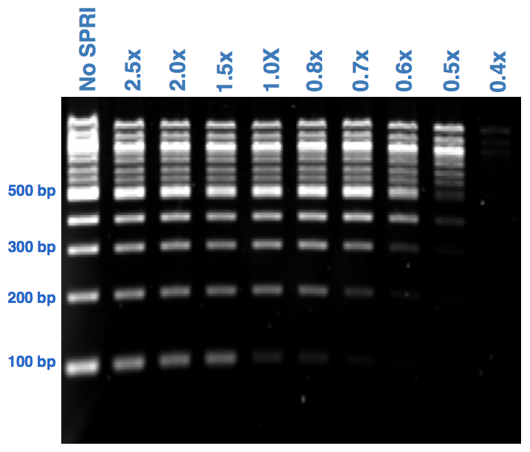

# Generic SPRI cleanup protocol

## Introduction
This protocol describes a generic DNA cleanup protocol with SPRI or Ampure XP beads suitable for PCR products.

Solid-phase reversible immobilization, or SPRI, is a method of purifying nucleic acids from solution. It uses carboxyl-coated paramagnetic beads. When the beads are resuspended in solutions with high concentrations of polyethylene glycol and salts, they are capable of binding reversibly to nucleic acids. This binding is size selective, in that longer polymers of nucleic acids bind more efficiently than shorter ones. This is ideal for removing short primer sequences from longer PCR products.

## Method

1. Prepare fresh 80% ethanol

> You will need (150 uL * 2 * number of samples) + a bit of overage

2. Add 1.5X uL SPRI beads to each PCR tube

> Add 1.5X of the volume of the sample being purified. This amount is suitable for most PCR products. If the product is very short (< 200 bp) increase to 1.8X. For example if your PCR product volume is 25 uL then add 37.5 uL of SPRI beads. 


```
Figure shows binding capacity of SPRI beads at different bead to sample ratios. 
```
3. Vortex or mix sample by pipetting up and down

4. Incubate at room temperature for 5 min
>The DNA is bound to the beads

5. Place on magnet
>Allow sample to clear. First time may a few minutes if the sample is viscous.

6. Discard supernatant and add 150 uL 80% ethanol

7. Incubate for 30 seconds then repeat steps 6 and 7

8. Quick spin the tube to pull down any residual ethanol

9. Use a 20 uL pipette to remove any residual ethanol (should only be a few uL if any) and leave to dry for ~3 min (tube lids open)

10. Remove tubes from magnet and add resuspend in water.
> The volume to resuspend in is dependent on the original sample volume and concentration. A simple guide would be 0.5-1X of the original volume.

11. Leave for ~1 minute then put back on magnet
> DNA is eluted into the H20

12. Place on magnet and pipette clean PCR into a fresh tube

13. Measure sample concentration by Qubit or Nanodrop