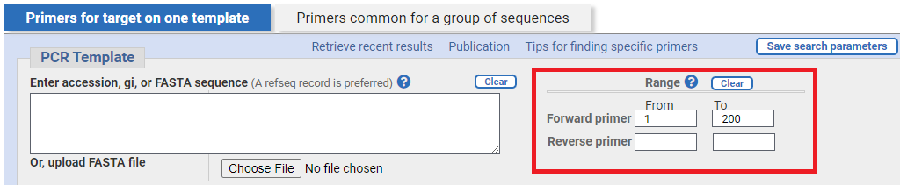
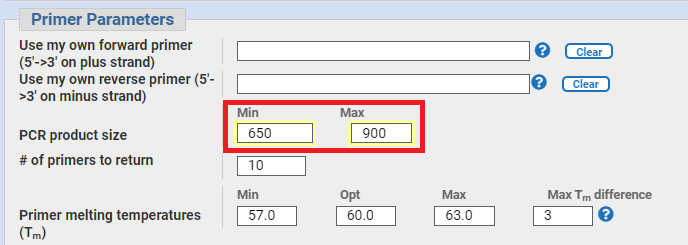
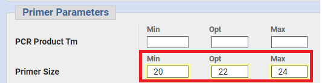
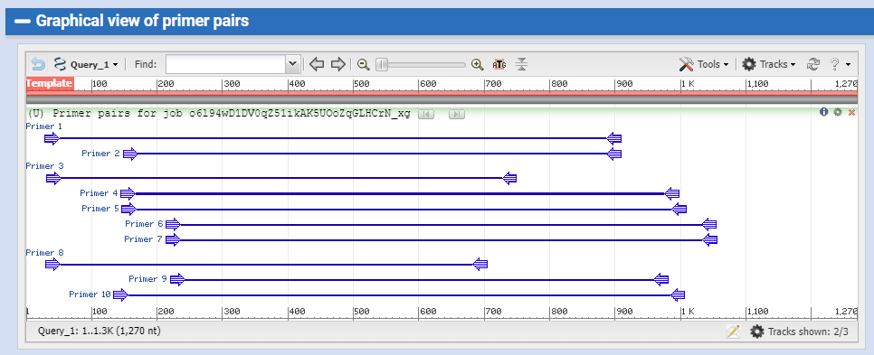
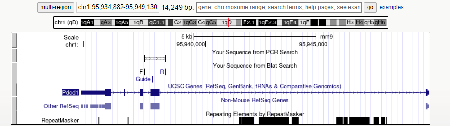
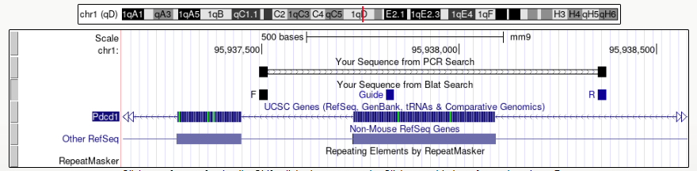
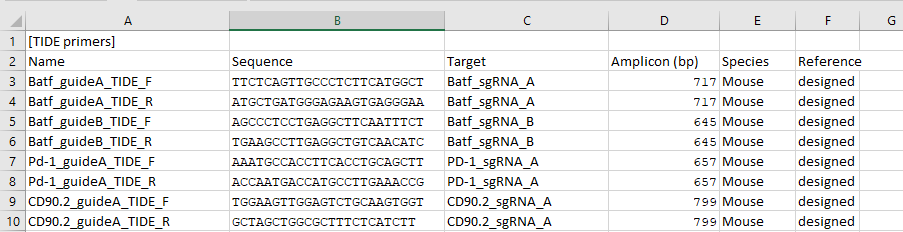

# Measurement of Cas9 editing efficiency at the DNA level by TIDE/ICE

## Introduction
This protocol is a guide on how to design primers to amplify the region surrounding a Cas9 edited site to measure the degree of editing. It presumes you have already designed or obtained the guide RNA sequence. PCR products amplified using this protocol should be sanger sequenced with the forward primer. Resulting traces can be decomposed using either TIDE (https://tide.nki.nl/) or ICE (https://ice.synthego.com/#/). Both of these tools require that a control trace is supplied (from an un-edited PCR product).

## General constraints

1. Amplicon length should optimally be between 650-900 bp. 

	>Some deviance is allowed if the locus is difficult to design for. The lower bound is about 500 bp. This is the minimum length for which the TIDE/ICE algorithms are able to decompose the mixed sequence. The upper bound is constrained by how long you can easily amplify PCR products (~5kb) and the length of sequencing that can be produced by Sanger sequencing (~1kb)

2. There should be ~200-300 bp from one end of the PCR product to the predicted Cas9 cut site.

	>The PCR product will be sequenced from this end. This yields ~200-300 bp of sequence that will be the same for wild-type and edited cells. i.e. the region before editing takes place. This is essential for the algorithms to pair the two sequence traces. The rest of the trace that is of mixed sequence in the edited cells (~500 bp) is used to deconvulute the alleles.

3. PCR primers must bind uniquely in the genome.

## The UCSC genome browser
The UCSC genome browser is a tool for hosting and visualising genome annotations. There are many types of data which can be visualised but for the purpose of this document the important ones are Refseq/UCSC gene annotations and repeat masker.

### Gene annotations
These indicate the presence of *genes*. The thick blue sections indicate *exons*, the thin lines with '>' indicate *introns*. The '>' indicates the direction of the gene. The thinner blue sections at the first and last exon indictate 5'-UTR and 3'-UTR respectively.

The Refseq track will generally have a single curated annotation for each gene. The Gencode or UCSC genes track may have multiple transcript variants which include/exclude certain exons or have alternative start/ends. If you left

## Method

1. Take the sequence of your guide and visualise it on the UCSC browser.
	
	- go to https://genome.ucsc.edu/
	- select the correct genome for your species (mouse/human); the assembly is not critical. Use the most recent.
	- go to Tools > Blat

		>Make sure you are still on the correct species/assembly

	- enter the guide in FASTA format i.e.
	```
	>name
	sequence

	e.g.
	>Guide1
	ACTGCATGATCGATGATTAG
	```

	- you should see a perfect match to a unique site in the genome (Score = 20)
	- click on browser to be taken to the browser view

	>You will be zoomed right in to the 20 bp.

	- Zoom out to visualise the whole gene by clicking one of the zoom out options or type the gene name in the search bar and click on it
	- If it is the first time you've used the browser there will be many superfluous tracks cluttering the view. Right click on the tab at the left end of the unwanted tracks and hide them. The tracks you wish to retain are the gene annotations (Refseq genes, UCSC genes) and crucially *RepeatMasker*.

	>Repetitive elements make up ~45% of the human/mouse genome and are unsuitable locations for primers. RepeatMasker is an annotation track that indicates the presence of repetitive elements. This includes viral elemenets (SINE/LINE etc) and simple repeats. The default view is 'dense', which is sufficient for our purposes as we want to avoid all repetitive elements. If you want to see what type of repeats there are you can  right-click on the tab at the left of the track and select 'full'.  It is ok for repeats to be part of the PCR product but attempts should be made to minimise this. Repetitive sequences are prone to PCR and sequencing errors that will confound TIDE/ICE analysis. 

2. Using your judgement and the constraints listed above. Hold the shift key and drag the mouse to select a suitable region around the guide to search for valid primers.

>Remember DNA is double stranded, it does not matter which strand you use so the best design might be going 'backwards' into the gene.

3. When you have found a suitable region. Select it with shift and choose 'Zoom In'.

> If you find your design running right to left you can select 'reverse' to switch the orientation if you find it mentally easier.

4. Select View > DNA. Then 'get DNA'. This will return the sequence of the DNA that was on the browser view in FASTA format.

5. Use a program to design PCR primers. Examples are AmplifX (on local computer) or through the web (https://www.ncbi.nlm.nih.gov/tools/primer-blast/). We will consider the NCBI tool - NCBI primer BLAST.

6. Enter the sequence from step 4 into the PCR template box. Based on your design above. Select a suitable region for the forward primer to reside in (ensuring sufficient length before the Cas9 cut site). The reverse primer can be left blank. The position of the reverse primer will be constrained by the minimum amplicon length set in the next step.



<br />

7. Set the amplicon length to suitable size.



<br />

8. Open the advanced tab and change the primer length parameters.



<br />

9. Hit the 'Get Primers' button. Results will take a minute or two to return. You will get an output resembling this:



Primer pairs are returned in order of quality based on a number of metrics. 

<br />

10. Check the top pair in the UCSC browser for uniqueness and that their position is suitable with respect to the guide (see General constraints).
	- Use Tools > Blat
	- Blat your two primers and the guide sequence.

	For example:
	```
	>F
	TTCTTTAGGGTCACACACCCTG

	>R
	AGGTAGAGACATCTTCGGGGAA

	>Guide
	GACACACGGCGCAATGACAG
	```

	- you should receive one perfect match for each sequence. If there is more than one match, select another primer pair and try again. 
	- click on browser view and visualise the whole gene. 
	- check there is sufficient length in the PCR product prior to the edit site.
	- as a final check go to Tools > In silico PCR and enter your forward and reverse primers
	- you should see that only one PCR product is generated, if not select another primer pair and begin again
	- visualise the whole gene on the browser. You should still see your BLAT result and the In silico PCR result

Whole gene view


Zoomed in


11. Save screenshots of your design similar to the ones in this report. 
>I recommend putting them straight into a powerpoint. Useful for when you have to present your data or explain to your supervisor etc what you have done.

12. Save your primer sequences to an oligo database
> I recommend starting an oligo database (excel file) with every sequence you design. You will find you have to revisit them often and if you have them all in one place it makes it a lot easier. 

Example database



The reference field I use if I take the sequence from a paper and is labelled 'designed' if I've designed it myself.


	

	


