# Quantitative PCR primer design

## Introduction
"A real-time polymerase chain reaction (real-time PCR, or qPCR when used quantitatively) is a laboratory technique of molecular biology based on the polymerase chain reaction (PCR). It monitors the amplification of a targeted DNA molecule during the PCR (i.e., in real time), not at its end, as in conventional PCR." 

"Reverse transcription polymerase chain reaction (RT-PCR) is a laboratory technique combining reverse transcription of RNA into DNA (in this context called complementary DNA or cDNA) and amplification of specific DNA targets using polymerase chain reaction (PCR)."

"The close association between RT-PCR and qPCR has led to metonymic use of the term qPCR to mean RT-PCR. Such use may be confusing, as RT-PCR can be used without qPCR, for example to enable molecular cloning, sequencing or simple detection of RNA. Conversely, qPCR may be used without RT-PCR, for example to quantify the copy number of a specific piece of DNA."

- Wikipedia.

For our purposes we will call it qPCR.


## Method

1. Load your gene of interest in the UCSC browser (https://genome.ucsc.edu/) and examine the exon structure among transcripts. Try to identify two adjacent exons that are common amongst all transcripts with sufficient intronic space between (see General constraints). 

>If there are very short introns then exons two or three apart from each other may be more appropriate. 

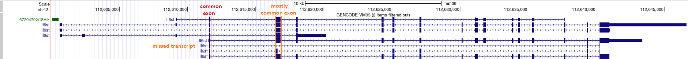

>Sometimes this is impossible. In that case choose the best two exons that cover the majority of transcripts. In the above diagram one exon is common to all known transcripts (red) and an adjacent exon is common to most transcripts (orange). One of the known transcripts is missed (orange).

2. Once identified obtain the sequence of these exons. You can use the browser to zoom in on the exons in question and use View > DNA or you can find the transcript at NCBI and use the annotation to get the sequence. I find the latter a cleaner way of doing it.

For NCBI:
	- Go to: https://www.ncbi.nlm.nih.gov/gene/ and search for your gene of interest (make sure you get the right species)


<br />

3. Find the NCBI Refseq mRNA annotation (Ctrl+F 'nm'). Click on the NM_####### link. (The first NM transcript is the longest and usually the one you want).

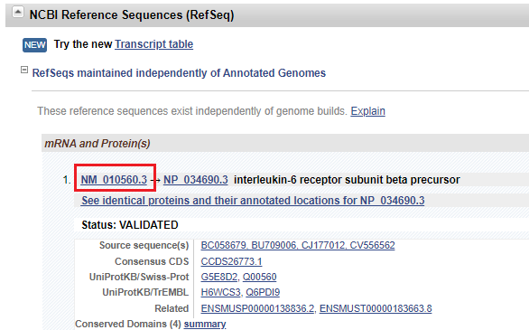

4. Scroll down to the 'Features' section and count the exons until you find the ones you want. In this example we want the sequence of exon 3.

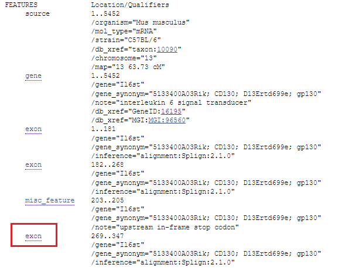
<br />

5. Open the two exons you want in new windows. At the top of each new page select 'FASTA' to get the sequence of each exon

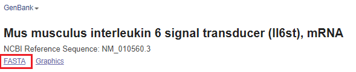

6. Go to a primer design tool such as NCBI primer blast (https://www.ncbi.nlm.nih.gov/tools/primer-blast/)

- paste the sequence of both exons into the PCR template box. Take note of the length of the first exon. (You can use a word processing tool to count the number of characters e.g. ms word or sublime text).
- in the range section enter values into the forward primer box to force the search for the forward primer to the first exon. i.e. in the 'From' section put '1' in the 'To' section put the length of the first exon.

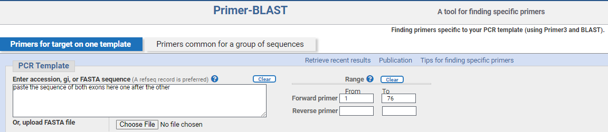

- adjust the amplicon size parameters

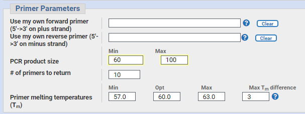

- in the advanced settings. Adjust the primer size parameters

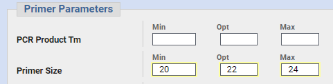

- Click 'Get Primers' - it will take a few minutes for the results to return. Results should resemble this:

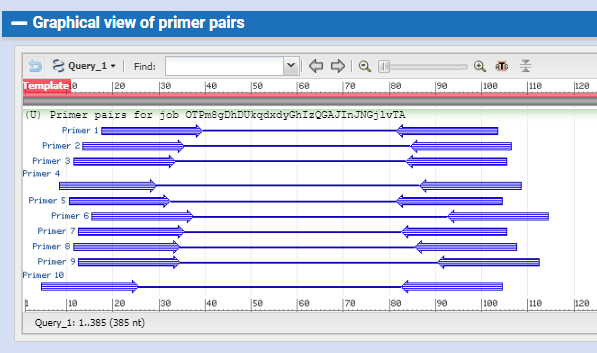

7. Check the top pair in the UCSC browser for uniqueness and that their position is suitable with respect to the gene structure (see General constraints).
	- Use Tools > Blat
	- Blat your two primers and the guide sequence.

	For example:
	```
	>F
	GTCAGCACCAAGGATTTGGCTA

	>R
	AACCACACGGTTCCAAAAGTTG
	```

	- you should receive one perfect match for each sequence. If there is more than one match, select another primer pair and try again. 
	- click on browser view and visualise the whole gene. 

8. Go to Tools > In silico PCR and enter your forward and reverse primers.
	- with the 'Target' set to the genome assembly you should either get:
		1. No matches
		2. A match that is significantly longer than the product you have designed

	- repeat step 5. and change the target to 'GENCODE genes'. You may get a single or multiple hits for the result. Make sure all the results are for transcripts of your gene of interest. Check that the amplicon size is the same for all results.

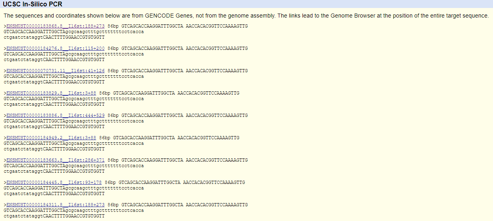
Note that all matches are to the Il6st gene and are the same length. Each result is matching to a different transcript isoform.

	- visualise the whole gene on the browser. You should still see your BLAT result and the In silico PCR result

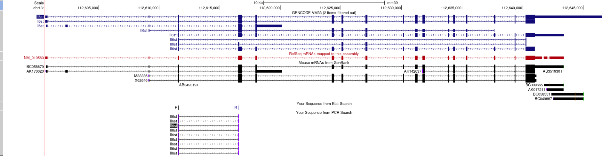

9. Save screenshots of your design similar to the ones in this report. 
>I recommend putting them straight into a powerpoint. Useful for when you have to present your data or explain to your supervisor etc what you have done.

10. Save your primer sequences to an oligo database
> I recommend starting an oligo database (excel file) with every sequence you design. You will find you have to revisit them often and if you have them all in one place it makes it a lot easier. 

Example database

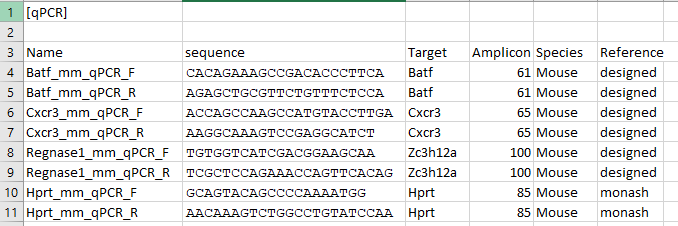

The reference field I use if I take the sequence from a paper and is labelled 'designed' if I've designed it myself.

## General constraints

1. Amplicon length should optimally be between 60 and 100 bp.

>Maximum amplicon length can be increased to 250 bp if no suitable primers are found between 60-100bp. The upper bound is constrained by the extension time of Taq and the amount of SYBR dye held in the reaction. Longer products will absorb more dye.

2. Primers should be at least 20 bp.

>This is not a functional constraint but a convenience factor as 20 bp is the minimum length for BLAT.

3. Primers should be in separate exons or cross an exon junction. The product off genomic DNA should be beyond the maximum amplicon length for qPCR (250 bp)

4. Primers should be placed in exons that are common within alternative transcripts

>This ensures that all isotypes of the gene are measured. This is desired in the majority of cases. 

5. Primers should be unique to your gene/transcript of interest.


